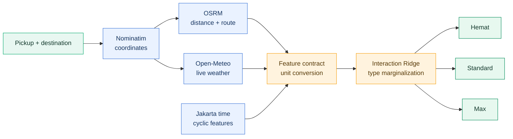

<div align="center">

# GRABIEZ

### Real-time GrabCar Fare Estimation

**Mobile-first pricing prototype berbasis rute, cuaca, waktu, dan machine learning**


[Cara kerja](#cara-kerja) · [Clustering](#dari-type-anonim-menjadi-tiga-produk) · [Model](#model-pricing) · [Menjalankan](#menjalankan-aplikasi) · [API](#api-utama)

</div>

---

Grabiez adalah prototype untuk mengestimasi tiga pilihan harga perjalanan: **GrabCar Hemat, GrabCar Standard, dan GrabCar Max**. Pengguna memilih titik jemput dan tujuan pada peta; aplikasi mengambil jarak jalan, durasi, cuaca, serta waktu terkini sebelum menjalankan model pricing.

## Product showcase

<table>
  <tr>
    <th width="50%">Reference experience</th>
    <th width="50%">Grabiez implementation</th>
  </tr>
  <tr>
    <td align="center">
      
    </td>
    <td align="center">
      
    </td>
  </tr>
  <tr>
    <td>Inspirasi pengalaman pemilihan rute dan layanan dalam aplikasi ride-hailing.</td>
    <td>Implementasi Grabiez: rute OSRM, cuaca real-time, dan estimasi Hemat/Standard/Max dari model.</td>
  </tr>
</table>

> Tampilan kiri digunakan sebagai referensi pengalaman pengguna. Grabiez adalah project independen untuk keperluan portfolio dan tidak berafiliasi dengan Grab.

| Product experience | Machine learning | Live context |
|:---:|:---:|:---:|
| Peta interaktif dan pencarian lokasi | Interaction Ridge + hierarchical mapping | Routing dan cuaca real-time |
| Tiga pilihan layanan | Chronological cross-validation | Feature engineering waktu |
| Estimasi dan rentang harga | Frequency-weighted inference | Mobile-first PWA |

Project ini memisahkan dua kebutuhan:

1. **Competition track** mengejar validasi yang sesuai urutan waktu dan menghasilkan submission.
2. **Deployment track** hanya memakai fitur yang benar-benar dapat tersedia ketika satu pengguna meminta quotation.

## Cara kerja



Frontend menampilkan geometry OSRM sebagai garis rute. Jarak yang masuk ke model adalah **driving distance**, bukan jarak garis lurus/Haversine.

## Dari `type` anonim menjadi tiga produk

### Problem yang diselesaikan

Dataset memiliki **20.355 baris dan 96 nilai `type` anonim**. `type` merupakan prediktor harga yang sangat kuat, tetapi kode seperti `0`, `1`, ..., `95` tidak dapat ditampilkan sebagai produk kepada pengguna. Di sisi lain, aplikasi membutuhkan kontrak yang sederhana dan stabil:

```text
service_tier_id = 1  →  GrabCar Hemat
service_tier_id = 2  →  GrabCar Standard
service_tier_id = 3  →  GrabCar Max
```

Masalahnya bukan sekadar mencari cluster dengan silhouette paling tinggi. Jumlah produk merupakan **business constraint**, sehingga output wajib tepat tiga cluster, mudah diurutkan dari murah ke mahal, dan dapat dibekukan menjadi lookup table untuk production.

### Kenapa profil distribusi harga?

Satu `type` muncul berkali-kali pada waktu, jarak, dan kondisi cuaca berbeda. Karena itu satu baris tidak cukup untuk mendeskripsikan produk. Setiap `type` lebih dahulu diringkas menjadi profil distribusi harga.

| Kandidat fitur | Pertimbangan |
|---|---|
| Mean | Representatif, tetapi mudah bergeser karena surge dan kondisi ekstrem |
| Standard deviation | Mengukur volatilitas, bukan posisi tier harga |
| Maximum | Sangat sensitif terhadap surge/outlier |
| Skewness | Berguna untuk bentuk distribusi, tetapi sulit dipakai mengurutkan produk |
| Minimum | Mendekati harga dasar suatu `type` |
| P10 | Harga rendah yang lebih robust daripada satu nilai minimum |
| P25 | Level harga bawah yang masih mewakili cukup banyak observasi |

Eksperimen dibatasi menjadi tepat **tiga fitur**. Kombinasi akhir adalah `minimum`, `P10`, dan `P25` dari `price_mean`: ketiganya menangkap posisi harga dasar tanpa terlalu dipengaruhi ekor kanan akibat lonjakan harga.

### Kenapa hierarchical clustering?

| Algoritma | Keputusan |
|---|---|
| K-Means | Bisa dipaksa menjadi 3 cluster, tetapi mengasumsikan cluster berbentuk sekitar centroid dan sensitif terhadap titik ekstrem |
| HDBSCAN | Baik untuk noise dan bentuk cluster bebas, tetapi jumlah cluster muncul dari density sehingga tidak menjamin tepat 3 produk |
| DBSCAN | Memiliki masalah constraint yang sama dan sensitif terhadap pemilihan `eps` |
| Gaussian Mixture | Memberi probabilitas cluster, tetapi menambah asumsi distribusi dan kompleksitas yang tidak dibutuhkan untuk 96 profil |
| Agglomerative + Ward | Dipilih: dapat dipotong tepat pada 3 cluster, cocok untuk jumlah objek kecil, dan menghasilkan hierarchy yang mudah diaudit |

Ward linkage menggabungkan kelompok dengan kenaikan within-cluster variance terkecil. Sebelum clustering, ketiga fitur distandardisasi agar skala satu statistik tidak mendominasi jarak Euclidean.

### Pipeline clustering

Proses lengkap tersedia di [`notebooks/analysis_price_by_type.ipynb`](notebooks/analysis_price_by_type.ipynb):

1. Bentuk profil setiap `type` dari data train saja.
2. Gunakan tiga statistik harga dasar: minimum, P10, dan P25 dari `price_mean`.
3. Standardisasi ketiga fitur.
4. Jalankan Agglomerative Hierarchical Clustering, Ward linkage, dengan `n_clusters=3`.
5. Evaluasi pemisahan menggunakan silhouette score: **0,660389**.
6. Urutkan cluster berdasarkan rata-rata P25, bukan nomor cluster acak.
7. Beri nama Hemat, Standard, dan Max.
8. Bekukan mapping sebagai artifact CSV.

Hasil mapping berisi **25 type Hemat, 47 type Standard, dan 24 type Max**, lalu disimpan di [`artifacts/type_cluster_mapping.csv`](artifacts/type_cluster_mapping.csv). Notebook menyertakan visualisasi rentang min–max/mean per `type` serta peta cluster berwarna.

### Kenapa ini tidak bocor ke test?

Ini merupakan **target-informed product mapping**, bukan unsupervised learning yang sepenuhnya bebas target. `price_mean` memang dipakai ketika merancang produk, tetapi hanya dari train:

```text
train price → profile per type → clustering → fixed mapping.csv
                                               │
test type ─────────────────────────────────────┘ → lookup tier
production tier selection ─────────────────────┘
```

Saat test atau production, sistem hanya melakukan lookup terhadap mapping yang sudah dibekukan. Target test, harga aktual perjalanan baru, dan hasil prediksi tidak pernah dipakai untuk menghitung ulang cluster.

> [!IMPORTANT]
> Clustering menjembatani kode `type` anonim dengan tiga produk yang dapat dipahami pengguna. Ia tidak menggantikan model pricing dan tidak dihitung ulang dari harga request production.

## Model pricing

### Kenapa Interaction Ridge?

Eksperimen awal menunjukkan raw `type` membawa baseline harga yang sangat besar. Model tree-based tidak memberi keuntungan yang sebanding pada struktur data ini, sedangkan linear model memberikan generalisasi temporal yang lebih stabil. Ridge dipilih karena:

- one-hot `type` menghasilkan banyak koefisien yang saling berkorelasi;
- regularisasi L2 menahan koefisien agar tidak ekstrem tanpa membuang kategori;
- polynomial interactions menangkap efek seperti `type × distance` dan `distance × weather`;
- inference ringan dan mudah dikemas sebagai artifact backend.

Model deployment menggunakan alpha **46,4159**, dipilih melalui chronological cross-validation, dengan CV RMSE **1,13865** pada feature contract production. Nilai ini berbeda dari competition model karena fitur agregat yang tidak tersedia real-time sengaja dibuang.

Pipeline model:

- one-hot encoding untuk raw `type` dan `service_tier_id`;
- standardisasi fitur numerik;
- interaksi polynomial derajat dua;
- alpha yang dipilih menggunakan chronological cross-validation;
- target `price_mean`, lalu dikonversi ke rupiah dengan skala artifact.

Fitur production:

| Sumber | Fitur model | Transformasi |
|---|---|---|
| OSRM | `distance_mean` | kilometer → mile agar sama dengan schema train |
| Open-Meteo | `temp` | Celsius → Fahrenheit |
| Open-Meteo | `humidity`, `clouds` | persen → fraksi 0–1 |
| Open-Meteo | `rain` | millimeter → inch |
| Open-Meteo | `wind` | km/jam → mph |
| Timestamp Jakarta | `hour_sin`, `hour_cos` | encoding siklik 24 jam |
| Timestamp Jakarta | `dow_sin`, `dow_cos` | encoding siklik 7 hari |
| Timestamp Jakarta | `is_weekend` | Sabtu/Minggu → 1 |
| Mapping artifact | `type`, `service_tier_id` | tier tetap hasil clustering train |

Di aplikasi, raw `type` tidak dipilih secara acak. Untuk setiap tier, backend memprediksi seluruh historical `type` yang termasuk tier tersebut dan menghitung ekspektasi berbobot frekuensi train. Quantile prediksi antar-type membentuk rentang harga bawah–atas.

Secara ringkas, estimasi pusat sebuah tier adalah:

```text
                  Σ frequency(type) × prediction(type, trip context)
fare(tier) =      ─────────────────────────────────────────────────
                              Σ frequency(type)
```

Dengan begitu pengguna cukup memilih Hemat, Standard, atau Max. Backend menangani ketidakpastian raw `type` secara deterministik; tidak ada pemilihan type secara random.

`api_calls` dan seluruh fitur `surge_*` sengaja tidak digunakan pada deployment karena nilainya merupakan agregat platform yang tidak tersedia dari satu request pelanggan. Competition notebook masih dipertahankan untuk eksperimen offline di [`notebooks/grabcar_pricing_optuna.ipynb`](notebooks/grabcar_pricing_optuna.ipynb).

### Dua jalur evaluasi

| Track | Tujuan | Fitur | Validasi/output |
|---|---|---|---|
| Competition | Menguji performa pada dataset challenge | Semua fitur train/test yang legal, termasuk raw `type` | Chronological CV dan submission |
| Deployment | Menjamin input bisa tersedia saat quotation | Jarak, cuaca, waktu, tier, dan mapping historis | Artifact FastAPI siap inference |

## Tech stack dan layanan

| Layer | Teknologi |
|---|---|
| Interface | HTML, CSS, JavaScript, Leaflet, PWA |
| Backend | Python, FastAPI, Pydantic, HTTPX |
| Machine learning | pandas, NumPy, scikit-learn, Optuna |
| Geocoding | Nominatim |
| Routing | OSRM |
| Weather | Open-Meteo |
| Basemap | CARTO + OpenStreetMap |

- **Nominatim**: geocoding nama lokasi menjadi koordinat. Request dilakukan ketika tombol pencarian ditekan, diberi cache dan rate limit.
- **OSRM**: menghitung rute berkendara, jarak, estimasi durasi, dan geometry garis rute.
- **Open-Meteo**: mengambil kondisi cuaca real-time pada titik pickup.
- **CARTO/OpenStreetMap**: basemap ringan untuk UI.

Endpoint publik cocok untuk demo, bukan traffic production. Deployment komersial sebaiknya memakai instance routing/geocoding sendiri atau provider dengan SLA dan mematuhi ketentuan atribusi masing-masing penyedia.

## Struktur project

```text
Grabiez/
├── artifacts/                 # model, metadata, dan mapping tier
├── backend/
│   ├── app.py                 # FastAPI, integrasi API, inference
│   └── build_model.py         # training deployment artifact
├── data/                      # train, test, sample submission
├── experiments/               # Optuna DB dan best configs
├── frontend/                  # PWA, map, dan service worker
├── notebooks/
│   ├── analysis_price_by_type.ipynb
│   └── grabcar_pricing_optuna.ipynb
├── outputs/submissions/       # hasil prediction kompetisi
├── tests/
├── requirements.txt
└── run_app.sh
```

## Menjalankan aplikasi

### 1. Install

Install dependency:

```bash
python -m pip install -r requirements.txt
```

### 2. Train ulang — opsional

Artifact yang sudah dilatih tersedia di repository. Untuk melatih ulang:

```bash
python -m backend.build_model
```

### 3. Start

Jalankan backend dan PWA:

```bash
bash run_app.sh
```

Buka `http://localhost:8000`. Dokumentasi API tersedia di `http://localhost:8000/docs`. Untuk mencoba dari HP pada Wi-Fi yang sama, buka `http://<IP-komputer>:8000`.

## API utama

| Method | Endpoint | Fungsi |
|---|---|---|
| `GET` | `/api/health` | status model |
| `GET` | `/api/geocode?q=...` | pencarian lokasi |
| `POST` | `/api/estimate` | routing, weather, feature engineering, dan tiga estimasi harga |

Contoh payload estimasi:

```json
{
  "pickup": {"lat": -6.2, "lon": 106.8167, "label": "Pickup"},
  "destination": {"lat": -6.1754, "lon": 106.8272, "label": "Destination"}
}
```

## Pengujian

```bash
python -m pytest -q
```

Test memeriksa health endpoint, mobile shell, kelengkapan tiga tier, urutan tier, serta konsistensi rentang estimasi.

```text
2 passed
```

## Batasan

- Label Hemat/Standard/Max adalah interpretasi dari data anonim, bukan label resmi dataset.
- Model belum memakai traffic real-time, ketersediaan driver, toll fee, atau surge internal.
- Akurasi competition track tidak dapat dianggap langsung sebagai akurasi harga dunia nyata.
- Model perlu retraining dan monitoring drift sebelum digunakan sebagai sistem pricing production.

---

<div align="center">
  <sub>Built as an end-to-end machine learning engineering portfolio project.</sub>
</div>
