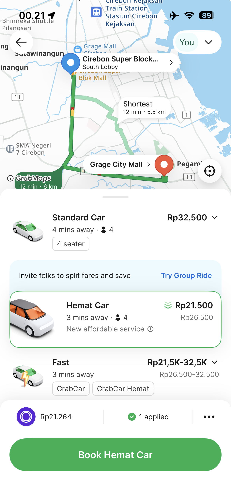
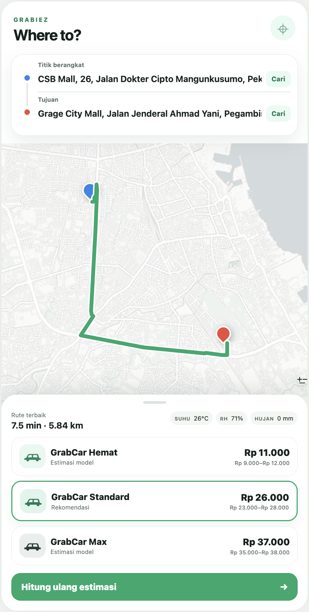
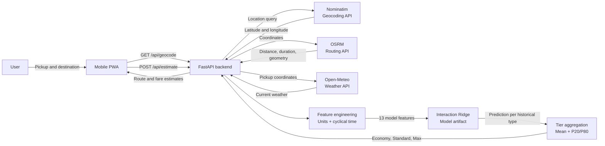
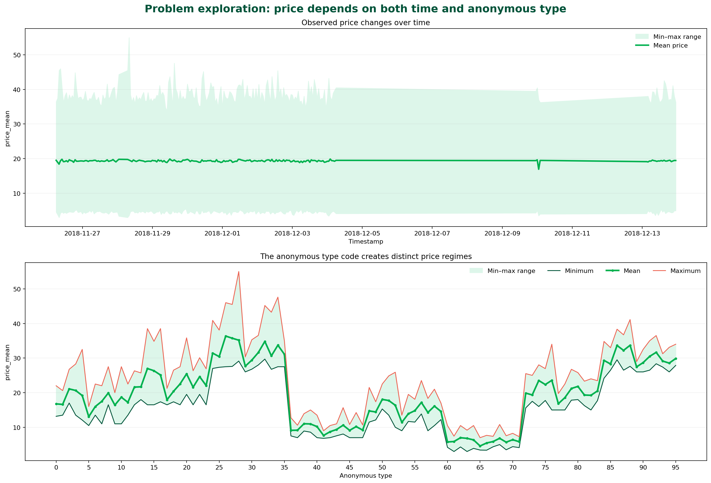
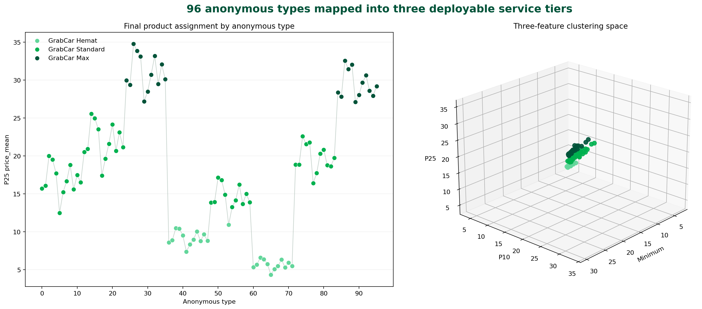

<div align="center">

# GRABIEZ

### Real-time GrabCar Fare Estimation

**A mobile-first pricing prototype powered by routes, weather, time, and machine learning**


[How it works](#how-it-works) · [Clustering](#from-anonymous-type-codes-to-three-products) · [Pricing model](#pricing-model) · [Run locally](#run-locally) · [API](#api)

</div>

---

Grabiez estimates three ride options: **GrabCar Economy, GrabCar Standard, and GrabCar Max**. A user selects pickup and destination points on a map; the application retrieves the road distance, route duration, current weather, and local time before running the pricing model.

## Product showcase

<table>
  <tr>
    <th width="50%">Reference experience</th>
    <th width="50%">Grabiez implementation</th>
  </tr>
  <tr>
    <td align="center"></td>
    <td align="center"></td>
  </tr>
  <tr>
    <td>Reference for the route and ride-selection experience.</td>
    <td>OSRM routing, live weather, and model-based Economy/Standard/Max estimates.</td>
  </tr>
</table>

> The interface on the left is used only as a product-experience reference. Grabiez is an independent portfolio project and is not affiliated with Grab.

| Product experience | Machine learning | Live context |
|:---:|:---:|:---:|
| Interactive map and location search | Interaction Ridge + hierarchical mapping | Real-time routing and weather |
| Three service options | Chronological cross-validation | Cyclical time features |
| Point and interval estimates | Uniform cross-type inference | Mobile-first PWA |

The project deliberately separates two objectives:

1. The **competition track** evaluates models in chronological order and produces submissions.
2. The **deployment track** uses only features that can be obtained when a customer requests a quote.

## How it works



An editable diagrams.net source is available at [`docs/architecture.drawio`](docs/architecture.drawio).

The frontend draws the OSRM geometry as the route line. The model receives the **driving distance**, not a straight-line or Haversine distance.

## From anonymous `type` codes to three products

### Problem

The dataset contains **20,355 rows and 96 anonymous `type` values**. `type` is a strong price predictor, but codes such as `0`, `1`, ..., `95` cannot be presented as customer-facing products. The application instead needs a stable contract:

```text
service_tier_id = 1  →  GrabCar Economy
service_tier_id = 2  →  GrabCar Standard
service_tier_id = 3  →  GrabCar Max
```

This is not merely a search for the largest silhouette score. The number of products is a **business constraint**: the result must contain exactly three clusters, support a clear low-to-high ordering, and be frozen as a production lookup table.

`service_tier_id` is not another learned feature or a second clustering result. It is a stable application ID assigned **after** clustering so the API, model artifact, and frontend can refer to the same product without depending on an arbitrary cluster number:

| Field | Meaning | Example |
|---|---|---|
| `type` | Original anonymous category from the dataset | `37` |
| raw cluster label | Temporary output from the clustering algorithm; order is arbitrary | `0` |
| `service_tier_id` | Stable product key used by the application | `1` |
| `service_tier` | Customer-facing product name | `GrabCar Economy` |

The raw cluster label is intentionally removed from the final mapping artifact because retaining both IDs created unnecessary ambiguity.

### What the original problem looks like



The upper panel shows temporal price movement. The lower panel shows why `type` cannot simply be discarded: different anonymous codes occupy visibly different price regimes.

### Why use price-distribution profiles?

Each `type` appears across different timestamps, distances, and weather conditions. A single row therefore cannot describe a product. Each type is first summarized as a price-distribution profile.

| Candidate feature | Consideration |
|---|---|
| Mean | Representative, but can shift because of surge and extreme conditions |
| Standard deviation | Measures volatility rather than the tier's price position |
| Maximum | Highly sensitive to surge and outliers |
| Skewness | Describes distribution shape but does not naturally order products |
| Minimum | Approximates the base price of a type |
| P10 | A low-price estimate that is more robust than one minimum observation |
| P25 | A lower price level supported by a larger share of observations |

The experiment was constrained to exactly **three features**. The selected combination is the `minimum`, `P10`, and `P25` of `price_mean`. Together they describe the base-price region without being dominated by the right tail caused by price spikes.

### Why hierarchical clustering?

| Algorithm | Decision |
|---|---|
| K-Means | Can force three clusters, but assumes centroid-shaped groups and is sensitive to extreme profiles |
| HDBSCAN | Handles noise and irregular shapes, but discovers the cluster count from density and cannot guarantee exactly three products |
| DBSCAN | Has the same cluster-count issue and is sensitive to `eps` |
| Gaussian Mixture | Provides soft assignments but adds distributional assumptions and unnecessary complexity for 96 profiles |
| Agglomerative + Ward | Selected: can be cut at exactly three groups, suits a small number of objects, and produces an auditable hierarchy |

Ward linkage merges the pair of groups that causes the smallest increase in within-cluster variance. All three features are standardized first so that one statistic cannot dominate the Euclidean distance.

### Clustering pipeline

The complete analysis is available in [`notebooks/analysis_price_by_type.ipynb`](notebooks/analysis_price_by_type.ipynb):

1. Build one profile per `type` using training data only.
2. Calculate the minimum, P10, and P25 of `price_mean`.
3. Standardize all three features.
4. Fit Agglomerative Hierarchical Clustering with Ward linkage and `n_clusters=3`.
5. Evaluate separation with a silhouette score of **0.660389**.
6. Order clusters by average P25 instead of arbitrary cluster IDs.
7. Assign the Economy, Standard, and Max product names.
8. Freeze the result as a CSV artifact.

The final mapping contains **25 Economy types, 47 Standard types, and 24 Max types**. It is stored in [`artifacts/type_cluster_mapping.csv`](artifacts/type_cluster_mapping.csv). The notebook includes the min–mean–max distribution plot and a color-coded cluster visualization.



The left panel maps every anonymous type to its final named service tier. The right panel shows the same assignments in the three-feature clustering space used by the model-selection experiment.

### Why this does not leak test targets

This is a **target-informed product mapping**, not clustering that is entirely independent of the target. `price_mean` is used to design the product tiers, but only using training data:

```text
train price → profile per type → clustering → fixed mapping.csv
                                               │
test type ─────────────────────────────────────┘ → tier lookup
production tier selection ─────────────────────┘
```

Test and production requests only look up the frozen mapping. Test targets, actual prices from new trips, and predictions are never used to refit the clusters.

> [!IMPORTANT]
> Clustering translates anonymous `type` codes into three understandable products. It does not replace the pricing model and is never recomputed from a production quote.

## Pricing model

### Why Interaction Ridge?

Initial experiments showed that raw `type` carries a large price baseline. Tree-based models did not provide a proportional improvement for this data structure, while regularized linear models generalized more consistently across time. Ridge was selected because:

- one-hot encoded `type` creates many correlated coefficients;
- L2 regularization limits extreme coefficients without discarding categories;
- pairwise interactions capture effects such as `type × distance` and `distance × weather`;
- inference is lightweight and easy to package as a backend artifact.

The deployment model uses alpha **46.4159**, selected through chronological cross-validation, and reaches a CV RMSE of **1.13865** under the production feature contract. This differs from the competition model because aggregate features unavailable at request time are intentionally excluded.

### Feature engineering contract

The model receives **13 final features**: two categorical and eleven numerical features.

#### Categorical features

| Feature | Source | Encoding |
|---|---|---|
| `type` | The 96 historical anonymous codes within a tier | One-hot with `handle_unknown="ignore"` |
| `service_tier_id` | Cluster mapping: 1 Economy, 2 Standard, 3 Max | One-hot |

#### Numerical features

| Final feature | Runtime value | Transformation |
|---|---|---|
| `distance_mean` | OSRM driving distance in km | `distance_km × 0.621371` |
| `humidity` | Open-Meteo relative humidity in percent | `relative_humidity_2m / 100` |
| `rain` | Open-Meteo rain in mm | `rain_mm / 25.4` |
| `temp` | Open-Meteo temperature in °C | `(temp_c × 9/5) + 32` |
| `wind` | Open-Meteo wind speed in km/h | `wind_kmh × 0.621371` |
| `clouds` | Open-Meteo cloud cover in percent | `cloud_cover / 100` |
| `hour_sin` | Jakarta hour, including minutes | `sin(2π × hour_decimal / 24)` |
| `hour_cos` | Jakarta hour, including minutes | `cos(2π × hour_decimal / 24)` |
| `dow_sin` | Day index from 0 to 6 | `sin(2π × day_of_week / 7)` |
| `dow_cos` | Day index from 0 to 6 | `cos(2π × day_of_week / 7)` |
| `is_weekend` | Jakarta calendar day | `1` on Saturday/Sunday, otherwise `0` |

Sine and cosine keep cyclical values close: 23:59 remains near 00:00, and Sunday remains near Monday. A plain integer encoding would lose this relationship.

Missing numerical values are imputed with training medians and standardized with training statistics. After categorical encoding and scaling, `PolynomialFeatures(degree=2, interaction_only=True)` generates pairwise effects without adding individual squared terms.

Example from the product screenshot:

```text
distance       = 5.84 km  → distance_mean = 3.63 miles
temperature    = 26°C     → temp          = 78.8°F
humidity       = 71%      → humidity      = 0.71
rain           = 0 mm     → rain          = 0
Jakarta time   = 00:21    → hour_sin/hour_cos
```

OSRM duration is displayed to the user but **does not enter the pricing model** because the training feature contract contains distance aggregates rather than an equivalent real-time travel-time feature. Route geometry is used only to draw the map.

### Training pipeline

- One-hot encode raw `type` and `service_tier_id`.
- Impute and standardize numerical features.
- Generate degree-two interaction features.
- Select alpha through chronological cross-validation.
- Fit Ridge against `price_mean` and package the full pipeline.

### How is the estimated price calculated?

Ridge does not use a fixed per-kilometer tariff. For every raw `type` inside a tier, it evaluates:

```text
prediction(type, context)
    = intercept
    + Σ coefficient_j × transformed_feature_j
    + Σ coefficient_jk × interaction(feature_j, feature_k)
```

The trip `context`—distance, weather, and time—is held constant across the raw types evaluated for that request. L2 regularization shapes the coefficients during training; no penalty term is manually added during inference.

Because users select a product tier rather than an anonymous raw type, the backend evaluates **every historical type in that tier**. Each type receives equal weight because the dataset is an almost perfectly balanced panel: every type appears between 210 and 213 times, so observed frequency is not a meaningful estimate of real-world market share.

```text
             Σ prediction(type, trip context)
fare(tier) = ───────────────────────────────────
                  number of types in tier
```

There is no random type selection. The final application values are:

```text
estimated_price = round_to_nearest_1,000(mean_prediction × 1,000)
lower_price     = round_to_nearest_1,000(P20(predictions_per_type) × 1,000)
upper_price     = round_to_nearest_1,000(P80(predictions_per_type) × 1,000)
```

Therefore, a value such as **Rp26,000** is not `distance × fixed rate`. It combines raw-type baselines with distance, weather, time, and pairwise interaction effects, then takes the arithmetic mean across all types in the Standard tier. The Rp23,000–Rp28,000 range describes variation across types within the tier; it is not a formal statistical confidence interval.

`api_calls` and all `surge_*` features are intentionally excluded from deployment because they are platform-level aggregates unavailable from a single customer quote. The offline competition experiments remain available in [`notebooks/grabcar_pricing_optuna.ipynb`](notebooks/grabcar_pricing_optuna.ipynb).

### Two evaluation tracks

| Track | Objective | Features | Validation/output |
|---|---|---|---|
| Competition | Evaluate performance on the challenge dataset | All legal train/test features, including raw `type` | Chronological CV and submission |
| Deployment | Guarantee that every input is available at quote time | Distance, weather, time, tier, and historical mapping | FastAPI-ready model artifact |

## Technology and external services

| Layer | Technology |
|---|---|
| Interface | HTML, CSS, JavaScript, Leaflet, PWA |
| Backend | Python, FastAPI, Pydantic, HTTPX |
| Machine learning | pandas, NumPy, scikit-learn, Optuna |
| Geocoding | Nominatim |
| Routing | OSRM |
| Weather | Open-Meteo |
| Basemap | CARTO + OpenStreetMap |

- **Nominatim** converts location queries into coordinates. Requests are triggered by an explicit search action, cached, and rate-limited.
- **OSRM** calculates the driving route, distance, estimated duration, and route geometry.
- **Open-Meteo** provides current conditions at the pickup location.
- **CARTO/OpenStreetMap** provides the lightweight basemap.

Public endpoints are appropriate for a prototype, not production traffic. A commercial deployment should use hosted or contracted routing/geocoding services with an SLA and comply with each provider's attribution requirements.

## Project structure

```text
Grabiez/
├── artifacts/                 # model, metadata, and tier mapping
├── backend/
│   ├── app.py                 # FastAPI, external APIs, inference
│   └── build_model.py         # deployment model training
├── data/                      # train, test, sample submission
├── experiments/               # Optuna state and best configs
├── frontend/                  # PWA, map, and service worker
├── notebooks/
│   ├── analysis_price_by_type.ipynb
│   └── grabcar_pricing_optuna.ipynb
├── outputs/submissions/       # competition predictions
├── tests/
├── requirements.txt
└── run_app.sh
```

## Run locally

### 1. Install dependencies

```bash
python -m pip install -r requirements.txt
```

### 2. Retrain the artifact — optional

A trained artifact is included in the repository. To rebuild it:

```bash
python -m backend.build_model
```

### 3. Start the application

```bash
bash run_app.sh
```

Open `http://localhost:8000`. Interactive API documentation is available at `http://localhost:8000/docs`. To test on a phone connected to the same Wi-Fi network, open `http://<computer-ip>:8000`.

## API

| Method | Endpoint | Purpose |
|---|---|---|
| `GET` | `/api/health` | Check model status |
| `GET` | `/api/geocode?q=...` | Search for a location |
| `POST` | `/api/estimate` | Retrieve routing/weather context and return three fare estimates |

Example request:

```json
{
  "pickup": {"lat": -6.2, "lon": 106.8167, "label": "Pickup"},
  "destination": {"lat": -6.1754, "lon": 106.8272, "label": "Destination"}
}
```

## Tests

```bash
python -m pytest -q
```

The tests cover the health endpoint, mobile shell, three-tier completeness and ordering, and fare-range consistency.

```text
2 passed
```

## Limitations

- Economy/Standard/Max are interpretations of anonymous data, not official dataset labels.
- The model does not include real-time traffic, driver availability, toll fees, or internal surge pricing.
- Competition-track accuracy should not be treated as real-world pricing accuracy.
- Production use would require retraining, monitoring, and drift detection.

---

<div align="center">
  <sub>Built as an end-to-end machine learning engineering portfolio project.</sub>
</div>
